Simulations and Artificial Behaviours
=====================================

Workshop at [CIID](http://ciid.dk), Copenhagen, February 2014 by [David Gauthier](http://gauthiier.info) & [Marcin Ignac](http://marcinignac.com)

This workshop investigates the potential of software as ground for design observations, explorations and artistic utterances. It focuses on concepts and techniques of computer simulations and artificial behaviour modelling, that is, the ways computation may be used to impart machines with anthropomorphic and naturalistic traits, character, actions and reactions. 

## Day 4: Signals

Include signals library

	
	

### Bitcoin
	
**Properties:**

`value` - bitcoin price level (0..1)  
`avgValue` - avg bitcoin price level (0..1)  
`delta` - bitcoin price level change (-1..1)  
`price` - bitcoin price in US dollars

**Events:**

*None*

**Example:**

	var bitcoin = new BitcoinSignal();
		
	function onFrame(event) {
		bitcoin.update(event.time)
		console.log(bitcoin.value);
		console.log(bitcoin.avgValue);
		console.log(bitcoin.delta);
		console.log(bitcoin.price);
	}
	
### Email
	
**Properties:**

`value` - new email level (0..1)  
`avgValue` - avg new email level (0..1)  
`delta` - new email level change (-1..1)  
`count` - number of new emails

**Events:**

`onEmail` - fired when new email arrives

**Example:**

	var email = new EmailSignal();

	email.onEmail = function(count) {
		console.log('You've got a message!')
	}
		
	function onFrame(event) {
		email.update(event.time)
		console.log(email.value);
		console.log(email.avgValue);
		console.log(email.delta);
		console.log(email.count);
		
	}

### Glucose
	
Properties:

`value` - glucose level (0..1)  
`avgValue` - avg glucose level (0..1)   
`delta` - glucose level change (-1..1)    
`level` - glucose level (raw data)  
`carbs` - carbohydrates level (food) (raw data)

Events:

`onFood` - fired when patient eats food

Example:

	var glucose = new GlucoseSignal();

	glucose.onFood = function(carbs) {
		console.log('mniam mniam!')
	}
	
	function onFrame(event) {
		glucose.update(event.time)
		console.log(glucose.value);
		console.log(glucose.avgValue);
		console.log(glucose.delta);
		console.log(glucose.level);
	}

### Weather

Properties:

`value` - wind speed level (0..1)  
`avgValue` - avg wind speed level (0..1)   
`delta` - wind speed level change (-1..1)    
`windSpeed` - wind speed  
`windDirection` - wind direction  
`temperature` - temperature  

Events:

*none*

Example:

	var weather = new WeatherSignal();
	
	function onFrame(event) {
		weather.update(event.time)
		console.log(weather.value);
		console.log(weather.avgValue);
		console.log(weather.delta);
		console.log(weather.windSpeed);
		console.log(weather.windDirection);
		console.log(weather.temperature);
	}

### Results day5

**Assertive**

**Attention seeking**

[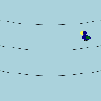](https://rawgithub.com/vorg/ciid-simulations-and-artificial-behaviours-2014/master/day5/explorations/attention_email_angelia_peter.html)
[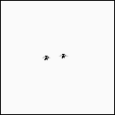](https://rawgithub.com/vorg/ciid-simulations-and-artificial-behaviours-2014/master/day5/explorations/attention_email_julian_anders.html)
[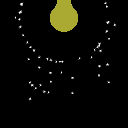](https://rawgithub.com/vorg/ciid-simulations-and-artificial-behaviours-2014/master/day5/explorations/attentionseeking_temprature_hisangLin_arunima.html)

**Exuberant**

[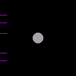](https://rawgithub.com/vorg/ciid-simulations-and-artificial-behaviours-2014/master/day5/explorations/exhuberant_weather_arun_kaitlyn.html)
[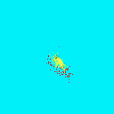](https://rawgithub.com/vorg/ciid-simulations-and-artificial-behaviours-2014/master/day5/explorations/exuberant_Weather_Chiayu_Yash.html)
[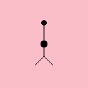](https://rawgithub.com/vorg/ciid-simulations-and-artificial-behaviours-2014/master/day5/explorations/exuberant_bloodglucose_hisangLin_arunima.html)

[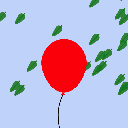](https://rawgithub.com/vorg/ciid-simulations-and-artificial-behaviours-2014/master/day5/explorations/exuberant_wind_angelisa_peter.html)

**Vivacious**

[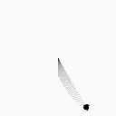](https://rawgithub.com/vorg/ciid-simulations-and-artificial-behaviours-2014/master/day5/explorations/vivacious_bitcoin_paula_francesca.html)

[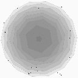](https://rawgithub.com/vorg/ciid-simulations-and-artificial-behaviours-2014/master/day5/explorations/vivacious_email_bethany_amalia.html)

[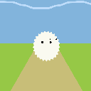](https://rawgithub.com/vorg/ciid-simulations-and-artificial-behaviours-2014/master/day5/explorations/vivacious_glucose_yash_chiayu.html)
[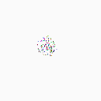](https://rawgithub.com/vorg/ciid-simulations-and-artificial-behaviours-2014/master/day5/explorations/vivacious_temp_haz_martino.html)

[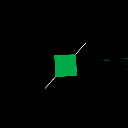](https://rawgithub.com/vorg/ciid-simulations-and-artificial-behaviours-2014/master/day5/explorations/vivaciuos_weather_saurabh_akarsh.html.html)

